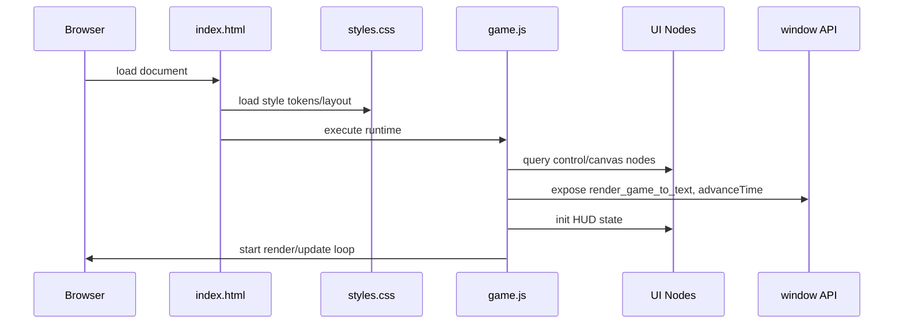
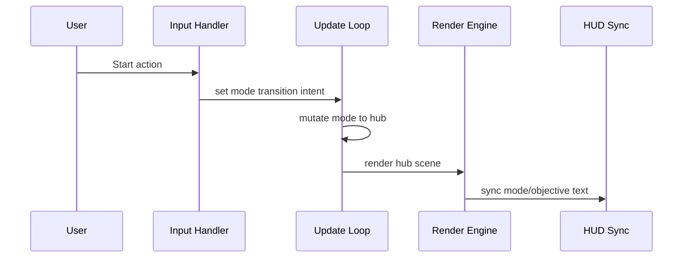
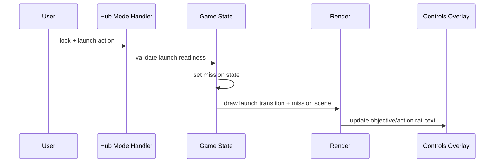
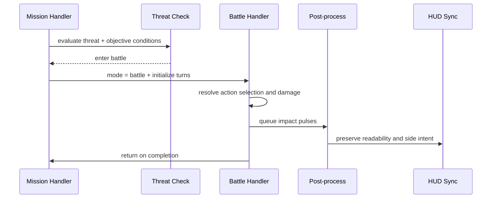
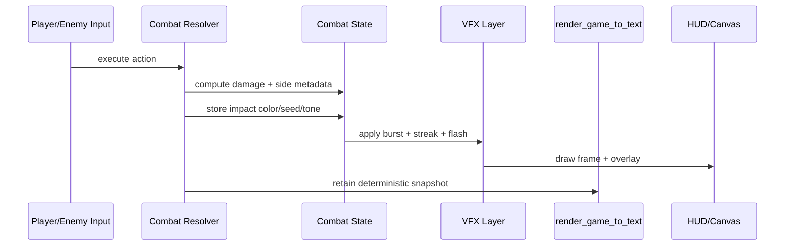
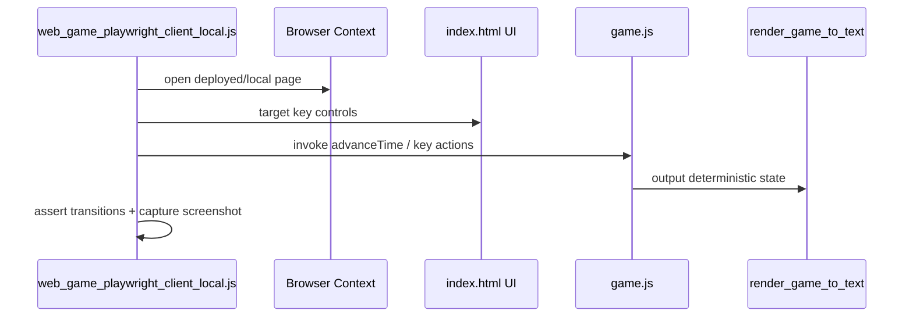
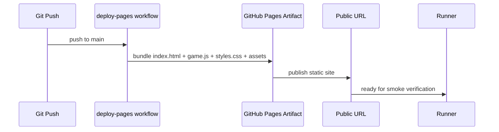

# Code Path Diagrams — NEWGAME

## Startup Path

## Title → Hub Flow

## Hub → Mission Launch Path

## Mission → Battle Loop

## Combat Attack Visual Path

## External Automation Path

## Deploy Path

## Notes on extension
- Add sequence nodes for any new gameplay mode before altering control contracts.
- Keep each sequence keyed to an acceptance check in component docs.
